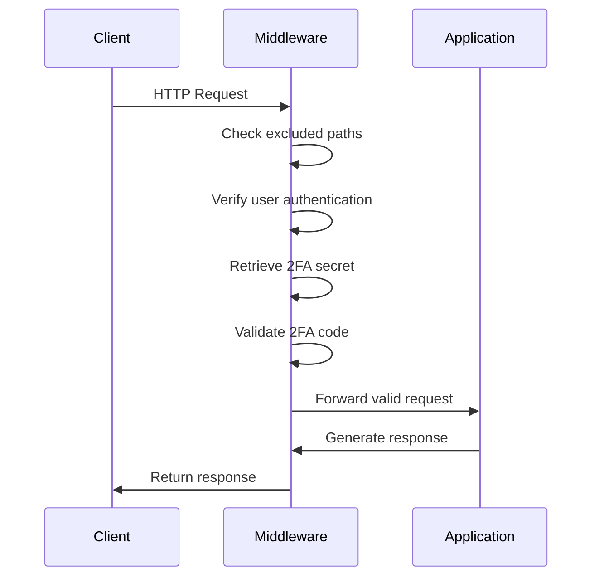
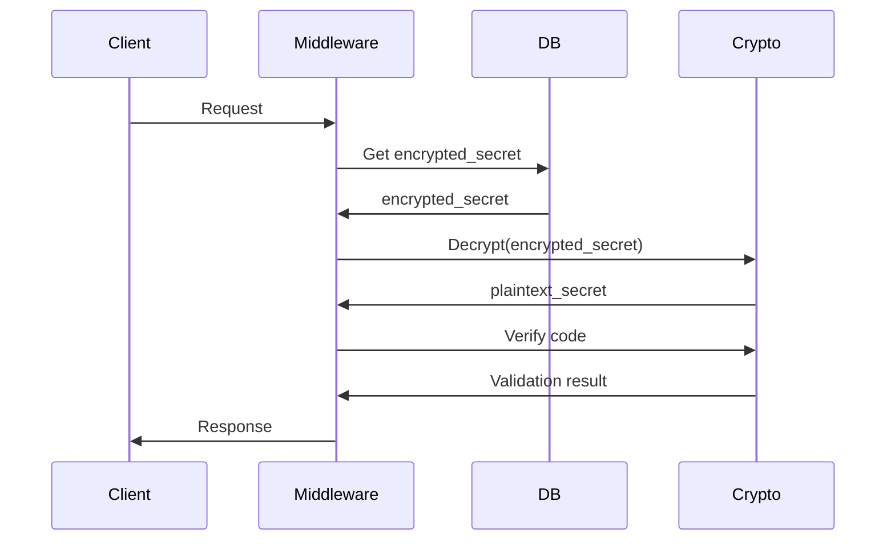

# TwoFactorMiddleware Class

## Class Definition
```python
class TwoFactorMiddleware(BaseHTTPMiddleware):
    def __init__(
        self,
        app: Callable[[Request], Awaitable[Response]],
        get_user_secret_callback: Callable[[str], Awaitable[Optional[str]]],
        *,
        excluded_paths: Optional[List[str]] = None,
        header_name: str = "X-2FA-Code",
        encryption_key: Optional[Union[str, bytes]] = None
    )
```

## Parameters
| Parameter | Type | Default | Description |
|-----------|------|---------|-------------|
| `app` | `Callable` | Required | FastAPI application instance |
| `get_user_secret_callback` | `Callable` | Required | Async secret retrieval function |
| `excluded_paths` | `List[str]` | `["/login", "/setup-2fa"]` | Paths to exclude from 2FA checks |
| `header_name` | `str` | "X-2FA-Code" | Header containing 2FA code |
| `encryption_key` | `str`/`bytes` | `None` | Fernet-compatible key for secret encryption |

## Methods
### `dispatch(request: Request, call_next) -> Response`
- Main middleware handler
- **Raises:** `HTTPException` for invalid/missing codes

## Error Handling
- `401 Unauthorized`: Missing/invalid 2FA code
- `500 Internal Server Error`: Secret retrieval failure
- `403 Forbidden`: Unauthenticated access attempt

## Example without Encryption
```python
from two_fast_auth import TwoFactorMiddleware

app.add_middleware(
    TwoFactorMiddleware,
    get_user_secret_callback=lambda uid: "user_secret",
    excluded_paths=["/docs", "/openapi.json"]
)
```

## Example with Encryption
```python
app.add_middleware(
    TwoFactorMiddleware,
    get_user_secret_callback=lambda uid: "encrypted_secret",
    encryption_key="your-32-url-safe-base64-key",
    excluded_paths=["/docs"]
)
```

## Request Handling Flow (No Encryption)


## Flow (No Encryption)
```mermaid
graph TD
    A[Request] --> B {Excluded path?}
    B -->  | Yes | C [Skip 2FA]
    B -->  | No  | D {Authenticated?}
    D -->  | No  | C
    D -->  | Yes | E {2FA Enabled?}
    E -->  | No  | C
    E -->  | Yes | F {Valid Code?}
    F -->  | Yes | C
    F -->  | No  | G [401 Error]
```

## Request Handling Flow (With Encryption)


## Flow (With Encryption)
```mermaid
graph TD
    A[Request] -->  B {Excluded path?}
    B -->     |Yes| C [Skip 2FA]
    B -->     |No|  D {Authenticated?}
    D -->     |No|  C
    D -->     |Yes| E {2FA Enabled?}
    E -->     |No|  C
    E -->     |Yes| F [Decrypt Secret]
    F          -->  G {Valid Code?}
    G -->     |Yes| C
    G -->     |No|  H [401 Error]
```
